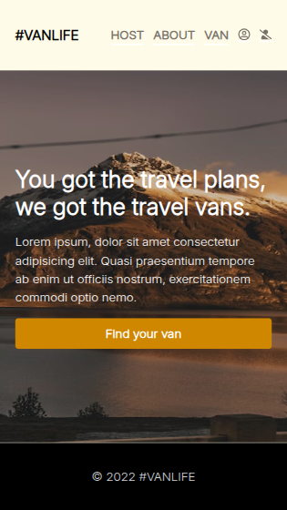
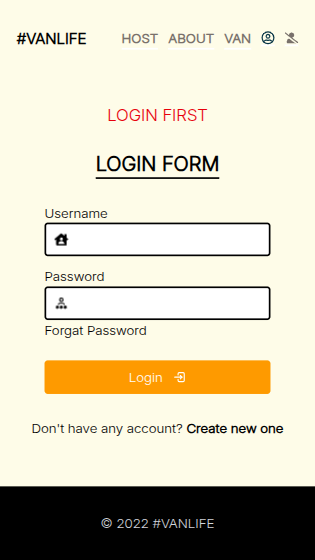
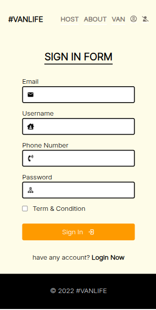
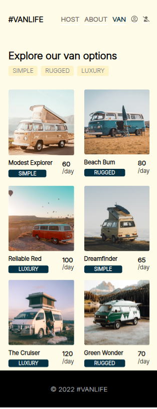
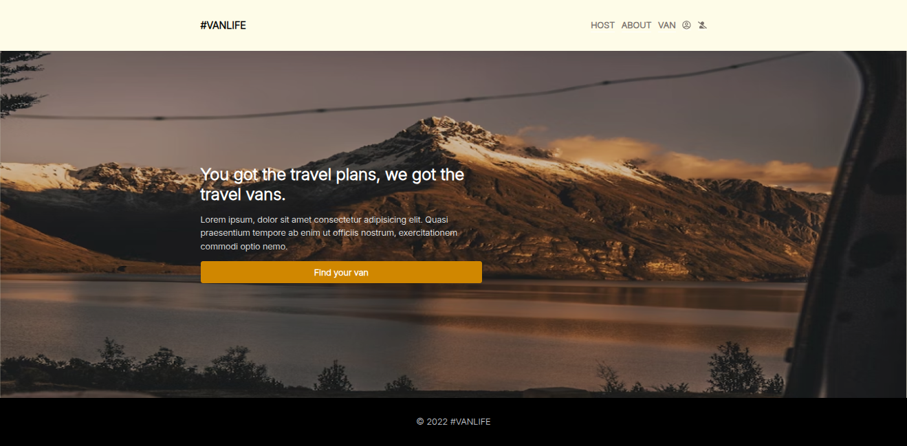

# Vanlife Application

**Vanlife Application** is a modern, clean, and fully responsive **React Application** designed to help taxi service agencies, and professionals create an impressive online presence. Perfect for startups and digital service providers looking to showcase their services in a single-page layout.

---

## 📱 Responsive Preview

<p align="center">
  
  
  
  
  
  
</p>

<p align="center">
  
  
</p>

## 📂 Project Structure

```bash
.
├── apps.jsx
├── assets
│   ├── fonts
│   │   ├── Inter-Bold.woff
│   │   ├── Inter-Light.woff
│   │   ├── Inter-Medium.woff
│   │   └── Inter-Regular.woff
│   └── images
│       ├── about-img.png
│       ├── home.png
│       └── van-1.jpg
├── global.css
├── host
│   ├── dashboard.jsx
│   ├── hostSingleVan.jsx
│   ├── hostvanDetials.jsx
│   ├── hostVan.jsx
│   ├── hostvanphoto.jsx
│   ├── hostvanprice.jsx
│   ├── income.jsx
│   └── reviews.jsx
├── main.jsx
├── pages
│   ├── about.jsx
│   ├── home.jsx
│   ├── van.jsx
│   └── vans.jsx
└── util
    ├── api.js
    ├── auth.jsx
    ├── errorHandle.jsx
    ├── error.jsx
    ├── footer.jsx
    ├── header.jsx
    ├── hostLayout.jsx
    ├── layout.jsx
    ├── loader.jsx
    ├── loading.jsx
    ├── login.jsx
    ├── notFound.jsx
    └── signUp.jsx
```

---

## 👨‍💻 Developed by Yeachen Abir

**Full-Stack Developer** skilled in custom websites, on-page SEO, and digital marketing.  
Proficient in **Shopify, WordPress, React.js, Node.js**, and **MongoDB**.  
I optimize for speed, UX, and SEO using tools like **Google Analytics (GA)** & **Google Search Console (GSC)** to boost visibility and performance.

---

### 🔗 Let’s Connect!

- 💼 [LinkedIn](https://www.linkedin.com/in/yeachen-abir/)  
- 📘 [Facebook Profile](https://www.facebook.com/yeachen.abir) | [Facebook Page](https://www.facebook.com/profile.php?id=61574159927866)  
- 🐦 [Twitter / X](https://x.com/YeachenA)  
- 📸 [Instagram](https://www.instagram.com/yeachenabir/)  
- 📌 [Pinterest](https://www.pinterest.com/yeachenabir/)  
- 📬 Email: [yeachenabir@gmail.com](mailto:yeachenabir@gmail.com)


> 🚀 Use this template to launch your business site, portfolio, or client project quickly and effectively.

**#yeachen #abir #webdeveloper #shopify #wordpress #ecommerce #custom_website #react_developer #next_developer #full_stack_developer**

---
